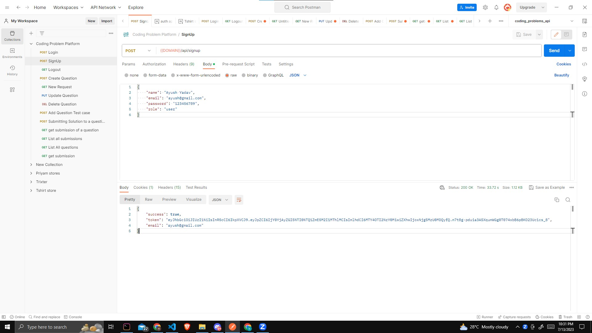
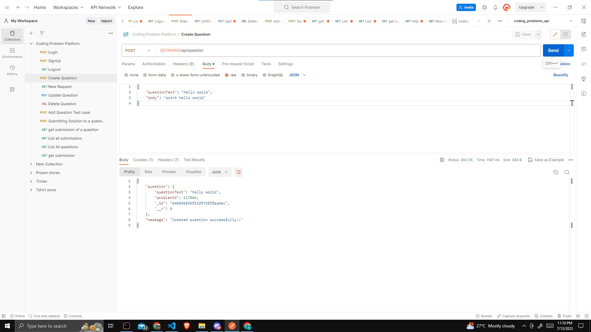
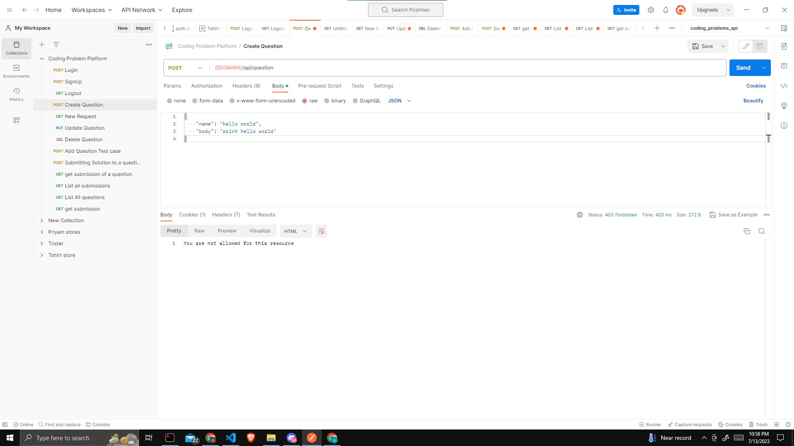
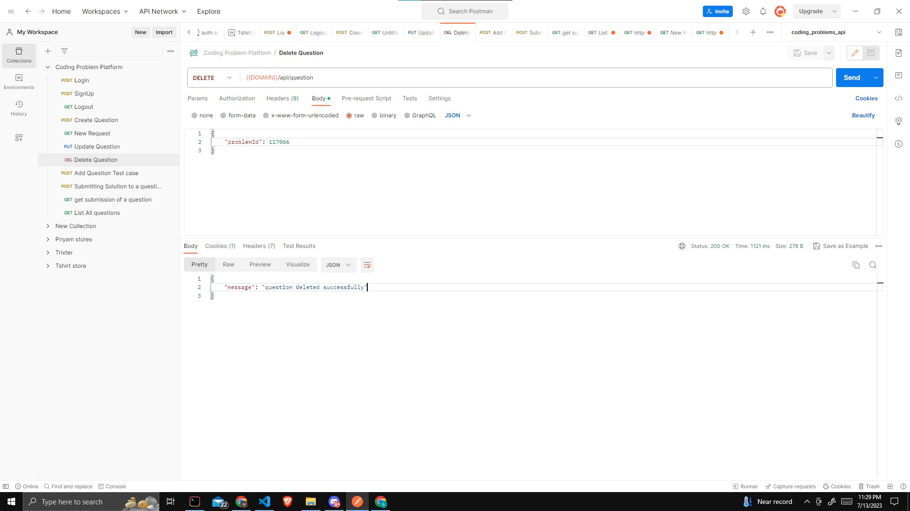
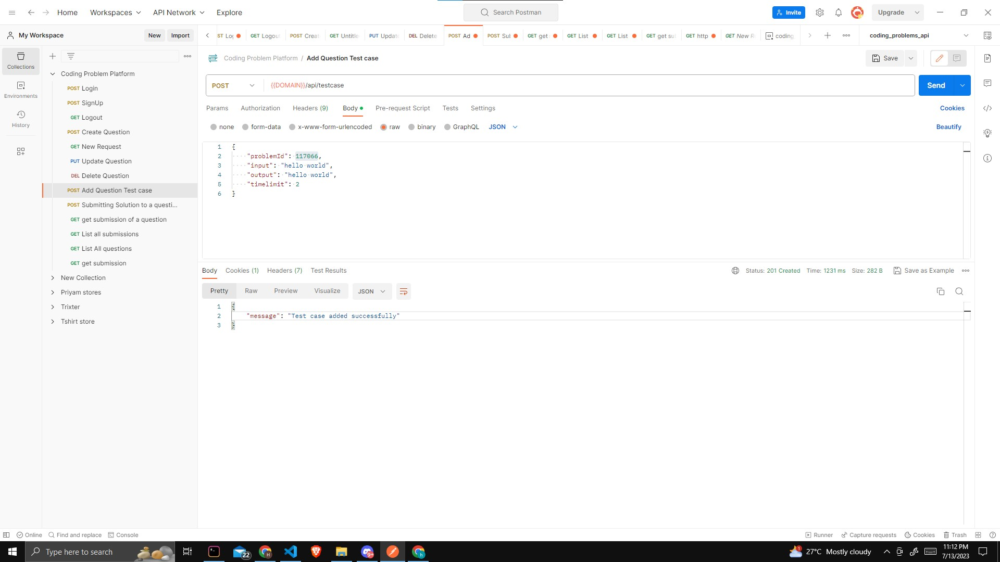
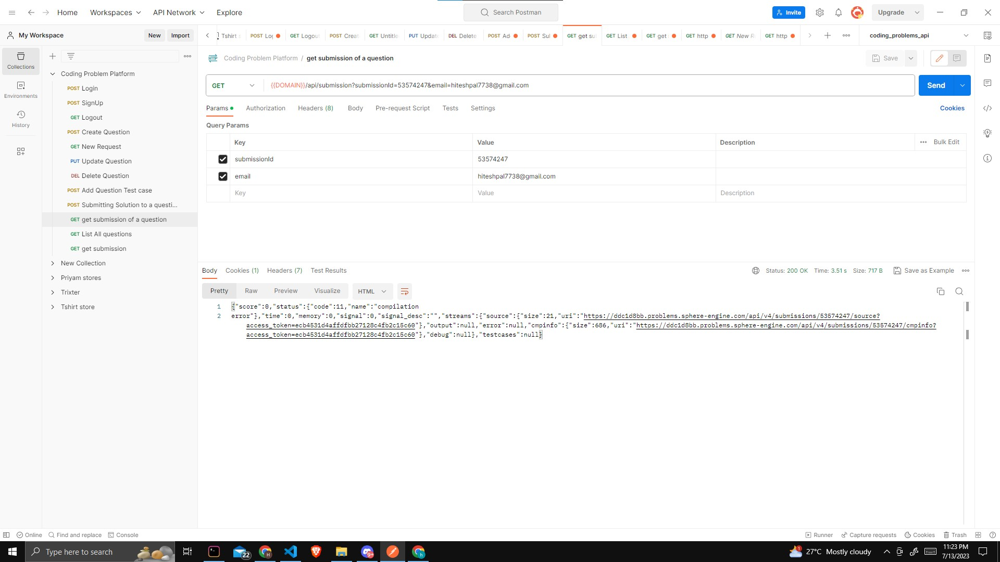
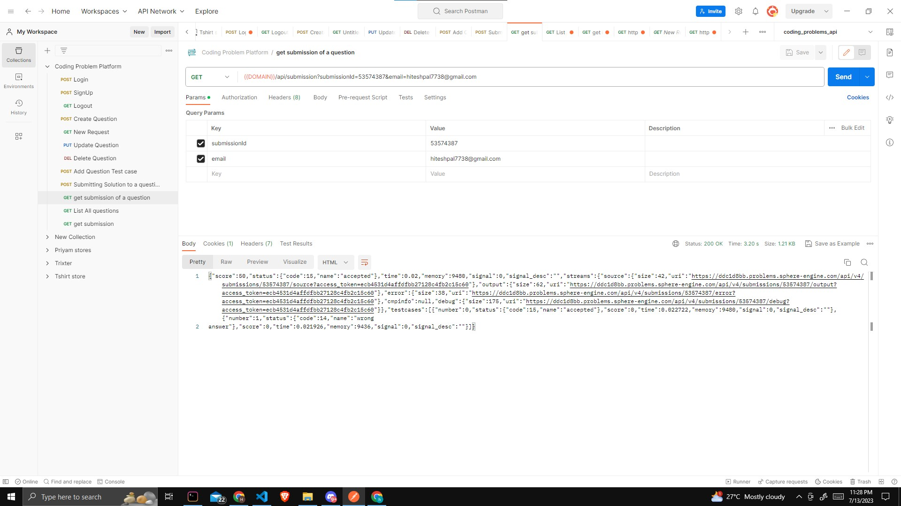
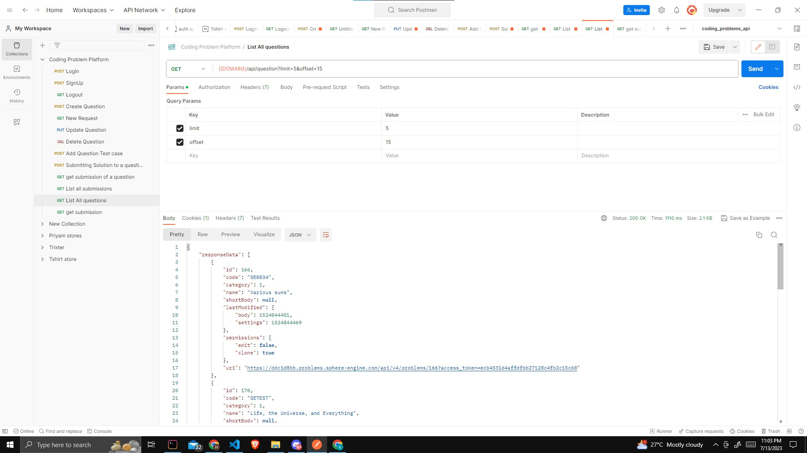

# Coding Assignment Platform Assignment

Description: This is the assignment from comet labs to create a backend for coding assignment platform

# Prereuisites
- Node js

Postman Link -> https://api.postman.com/collections/16878563-84e7c186-19ec-4ba5-92d1-53afde60df34?access_key=PMAT-01H58878NRT3C9V0154ADA30PW

## API Documentation

### Signup API

This API allows users to sign up for the coding platform.

- **URL:** `/signup`
- **Method:** POST
- **Request Body:**
  - `name`: User's name
  - `email`: User's email address
  - `password`: User's password
  - `role`: User's role (admin or participant)
- **Response:**
  - `email`: User's email address
  - `accessToken`: JWT access token for authentication

### Login API

This API allows users to log in to the coding platform.

- **URL:** `/login`
- **Method:** POST
- **Request Body:**
  - `email`: User's email address
  - `password`: User's password
- **Response:**
  - `email`: User's email address
  - `accessToken`: JWT access token for authentication

### Add Question API

This API allows the admin to add a new question to the coding platform.

- **URL:** `/question`
- **Method:** POST
- **Authorization:** Bearer Token (admin access token)
- **Request Body:**
  - `title`: Title of the question
  - `description`: Description of the question
  - `typeId`: problem type
- **Response:**
  - `questionResponse`: Response from sphere engine
  - `message`: Created question successfully!!

- `Error for user role creating question`

### Edit Question API

This API allows the admin to edit an existing question on the coding platform.

- **URL:** `/api/question`
- **Method:** PUT
- **Authorization:** Bearer Token (admin access token)
- **Request Body:**
  - `title`: Updated title of the question
  - `description`: Updated description of the question
  - `problemId`: Question ID
- **Response:**
  - `updateQuestionResponse`: Updated question response from sphere engine
  - `message`: Question updated successfully

### Delete Question API

This API allows the admin to delete a question from the coding platform.

- **URL:** `/api/question`
- **Method:** DELETE
- **Authorization:** Bearer Token (admin access token)
- **Request Body:**
  - `problemId`: Question ID
- **Response:**
  - `message`: Confirmation message for successful deletion

### Add Test Case API

This API allows the admin to add a test case to a question on the coding platform.

- **URL:** `/api/testcase`
- **Method:** POST
- **Authorization:** Bearer Token (admin access token)
- **Request Body:**
  - `input`: Input for the test case
  - `output`: Expected output for the test case
  - `problemId`: Question ID 
  - `timelimit`: Timelimit to execute the code
- **Response:**
  - `message`:Test case added successfully

### Submit Solution API

This API allows participants to submit their solution for a particular question on the coding platform using Sphere Engine.

- **URL:** `/api/submission`
- **Method:** POST
- **Authorization:** Bearer Token (participant access token)
- **Request Body:**
  - `source`: Code solution provided by the participant in string format
  - `problemId`:Question ID
- **Response:**
  - `submissionId`: Result of the solution (error/wrong/success)
  - `message`: solution submitted successfully

### Get Solution API

This API allows participants to get their solution for a particular question on the coding platform.

- **URL:** `/api/submission?submissionId={submissionId}&email={emailId}`
- **Method:** GET
- **Authorization:** Bearer Token (participant access token)
- **Request Body:**
  - `source`: Code solution provided by the participant in string format
  - `problemId`:Question ID
- **Response:**
  - `solutionResponse`: Return the result of the solution

### List Question (with Pagination) API

This API provides pagination support to fetch a desired number of user questions or admin submissions.

- **URL:** `/api/question?offset={offset}&limit={limit}`
- **Method:** GET
- **Authorization:** Bearer Token (admin or participant access token)
- **Response:**
  - `responseData`: Array of questions (based on pagination)
  - `paging`: Consist pagination info

### Connect with me 
[Twitter](https://twitter.com/HiteshP25522550) 
[Linkdin](https://www.linkedin.com/in/hitesh-pal-61935827b/)
